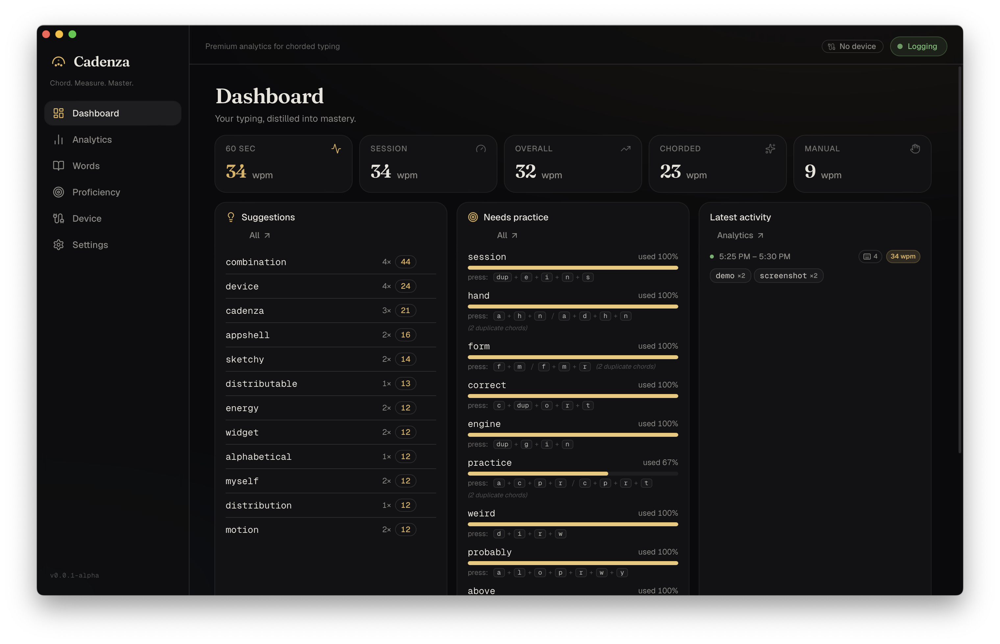
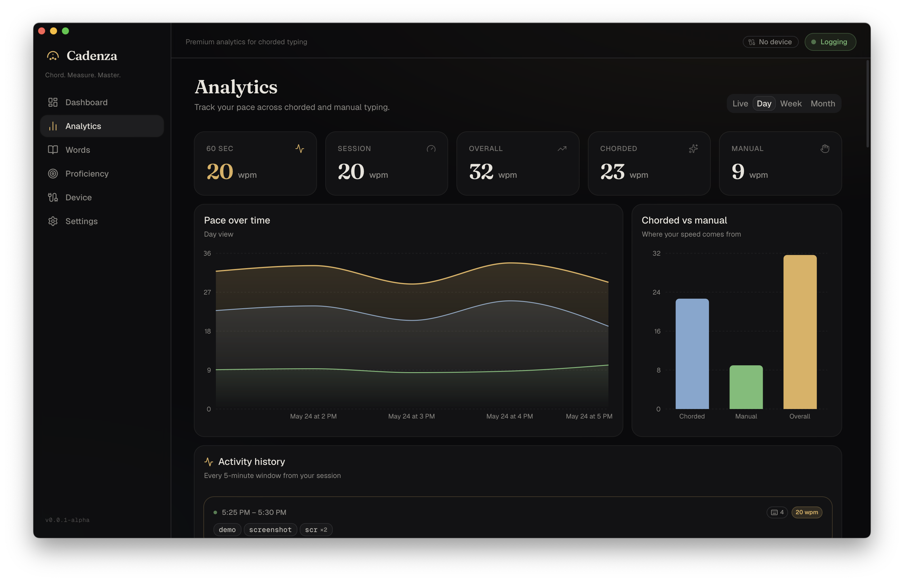

<div align="center">


# Cadenza

**Master your chords.**
Real-time typing analytics for CharaChorder chording keyboards.

[](https://github.com/natebakescakes/cadenza/releases)
[](https://github.com/natebakescakes/cadenza/releases)
[](./LICENSE)
[](#install)
[](https://tauri.app)

<br />


</div>

---

## What is Cadenza?

Chording keyboards like the CharaChorder let you fire whole words in a single
motion — but the hard part is *building the muscle memory*. Cadenza is the
practice partner: it watches how you actually type, then tells you what to work
on next.

It logs your keystrokes locally, figures out whether each word was **typed by
hand** or **fired as a chord** (purely from output timing — no integration
needed), and turns that into a live dashboard you can leave open on a second
screen while you work.

> **Alpha.** Cadenza is early and macOS-first. It works, it's useful, and it's
> evolving fast. Expect rough edges.

## Features

**Live WPM, split by how you type.**
Rolling, session, and all-time words-per-minute — broken out into *chorded* vs
*manual* throughput so you can see exactly where your speed comes from.

**Chord suggestions that respect your device.**
Cadenza ranks the words you keep typing **by hand** and suggests the highest-
impact ones to turn into chords — automatically excluding words you already have
chords for, plurals and conjugations the device handles with its special keys,
and punctuation/navigation noise.

**Proficiency that knows what "hard" means.**
For every chord on your device, Cadenza tracks how often you actually reach for
it, how fast you fire it, and how often you fumble and delete it. "Needs
practice" is ranked by real difficulty — error-prone and slow chords first, not
just your most common words — and shows you **which keys to press** so you never
have to leave the app.

**A glanceable second-screen dashboard.**
Top suggestions, chords to practice, and your latest activity — laid out to fit a
1440×900 secondary display with no scrolling. A calm, always-on coach.

## How it works

Cadenza never touches the keyboard's input layer — it only sees the characters
your device emits to the OS, plus their timing. A chord (or arpeggiate) dumps its
output as a near-instant burst; a human types far slower. That single signal —
inter-character timing — is enough to classify almost everything:

```
        keystroke stream
              │
   ┌──────────┴───────────┐
   │  inter-char timing    │
   └──────────┬───────────┘
       fast burst? ──► chord  (cross-referenced against your device's chord map)
       human pace? ──► word   (a candidate for a future chord)
```

Pair that with the chord map read straight off the device over serial, and
Cadenza knows not just *how fast* you type, but *how well you're using the
device you bought*.

## Screenshots

<div align="center">


</div>

## Install

Cadenza is in alpha; there are no prebuilt binaries yet. Build from source:

**Prerequisites:** [Node.js](https://nodejs.org) 22+, [Rust](https://rustup.rs) (stable), and the [Tauri prerequisites](https://tauri.app/start/prerequisites/) for your OS.

```sh
git clone https://github.com/natebakescakes/cadenza
cd cadenza
npm install
npm run tauri dev      # run in development
# or
npm run tauri build    # produce a desktop bundle
```

On first launch (macOS), grant Cadenza **Accessibility** and **Input
Monitoring** permission (System Settings → Privacy & Security) so it can observe
your typing, then click **Start Logging**. Connect your CharaChorder on the
**Device** tab to sync its chord map.

## Privacy

Everything stays on your machine. Cadenza logs keystrokes **locally** to a
SQLite database in your app-data directory and never sends them anywhere. You can
pause logging at any time, ban specific words from ever being recorded, and the
database is gated behind a password. **Don't type secrets while logging** — ban
or pause first.

## Roadmap

- [ ] One-click "build this chord" — push suggestions straight to the device
- [ ] Consolidate duplicate chords down to one canonical combination
- [ ] Live HUD overlay while you type in other apps
- [ ] Windows & Linux builds
- [ ] Real at-rest database encryption (SQLCipher)
- [ ] Prebuilt release binaries

## Built with

[Tauri 2](https://tauri.app) · [React](https://react.dev) · [Rust](https://www.rust-lang.org) · [shadcn/ui](https://ui.shadcn.com) · SQLite

Cadenza derives its detection and device logic from two CharaChorder projects
(both AGPL-3.0): **[nexus](https://github.com/CharaChorder/nexus)** (keystroke
detection / classification) and
**[DeviceManager](https://github.com/CharaChorder/DeviceManager)** (serial
communication and chord-map handling). Cadenza is an independent project and is
not affiliated with or endorsed by CharaChorder.

## License

[GNU Affero General Public License v3.0](./LICENSE). Because Cadenza builds on
AGPL-3.0 code, it is AGPL-3.0 too.

---

<details>
<summary><strong>Capturing the demo GIF / screenshots</strong> (maintainer notes)</summary>

- **GIF** → `docs/demo.gif`. Record the dashboard with the app live (type a bit,
  fire some chords so the activity feed and WPM move). Keep it ~6–10s, ≤ ~5 MB.
- **Screenshots** → `docs/dashboard.png`, `docs/analytics.png` (add more and wire
  them into the Screenshots section).
- Recommended free tools: **[Kap](https://getkap.co)** (macOS, exports GIF/MP4)
  or **[Gifski](https://gif.ski)** to convert a screen recording into a small,
  high-quality GIF. Trim tightly and crop to the window.

</details>
